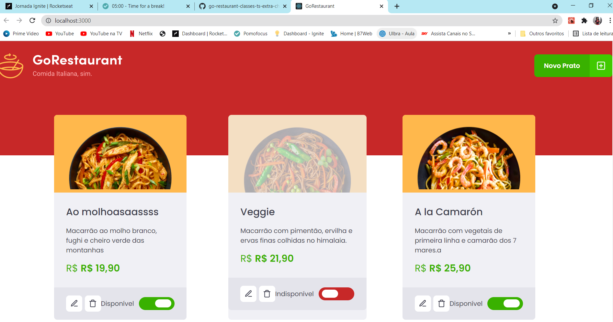

# go-restaurant-classes-ts-extra-challenge

<h1 align='center'>    
    

    

</h1>

<h2>🔗 Descrição</h2>

Aplicação web que renderiza uma lista de pratos de um restaurante, e permite adicionar novos pratos 

É possível editar e deletar pratos existentes também.

O intuito maior desse projeto era fazer a migração de classes components para <a href="https://blog.rocketseat.com.br/react-hooks/">function components</a> e também de Javascript para <a href="https://blog.rocketseat.com.br/typescript-vantagens-mitos-conceitos/">Typescript</a>

<h2>✨ Layout do projeto</h2>

  </a>

    Tela da Aplicação web

<h2> 🛠 Tecnologias utilizadas</h2>

As seguintes ferramentas foram usadas na construção deste projeto:

- [React](https://pt-br.reactjs.org/)
- [TypeScript](https://www.typescriptlang.org/)
- [Yarn](https://yarnpkg.com/)
- [JSON server](https://github.com/typicode/json-server)
- [Hooks](https://pt-br.reactjs.org/docs/hooks-custom.html)
- [Axios](https://blog.rocketseat.com.br/axios-um-cliente-http-full-stack/)

<h2>
    🚀 Como executar o projeto
</h2>

<li>Clone o projeto para uma pasta sua com o comando: <code>git clone https://github.com/mstarkRules/go-restaurant-classes-ts-extra-challenge.git<code> </li>

<li>Instale as dependências com o NPM <code>npm install</code> ou YARN <code>yarn</code></li>
<li>rode o servidor do JSON server com <code>yarn server</code></li>
<li>Inicie o projeto com <code>yarn start</code> ou <code>npm run dev</code></li>
